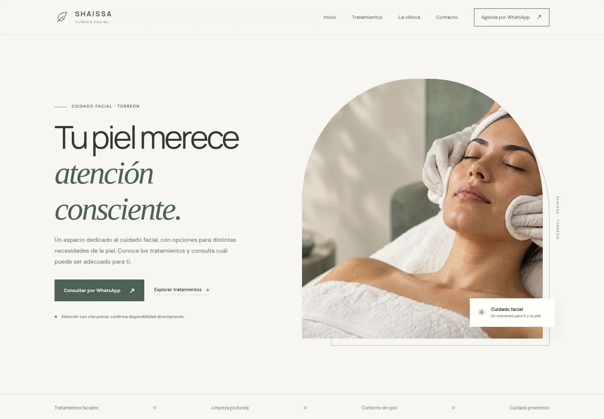

# Shaissa Clínica Facial

**Diseño web premium y adaptable para una clínica facial en Torreón, Coahuila.** Un sitio estático, ligero y listo para alojarse, con atención especial a móvil y a las consultas por WhatsApp.



[Ver también la vista móvil](docs/preview-mobile.webp)

## Acerca del proyecto

La página presenta a Shaissa Clínica Facial con una dirección visual sobria y cálida: tonos marfil y salvia, tipografía editorial, espacios amplios y fotografías ilustrativas. El diseño prioriza la información útil, una navegación sencilla y el contacto directo, sin prometer resultados ni sugerir que una cita queda reservada automáticamente.

### Incluye

- Diseño responsive para escritorio, tablet y móvil.
- Navegación móvil accesible y enlaces directos a las secciones principales.
- Enlaces de WhatsApp con el número **+52 871 435 2416** y mensaje de consulta precargado.
- Dirección, teléfono, correo y enlace para obtener indicaciones.
- Presentación de los servicios reportados: tratamientos faciales, limpieza profunda y tratamiento para contorno de ojos.
- Metadatos SEO, datos estructurados de negocio y favicon SVG.
- Fotografías ilustrativas originales, optimizadas en WebP; no representan la clínica, su personal ni clientes reales.
- Implementación con HTML, CSS y JavaScript vanilla; sin backend, build ni dependencias de ejecución.

## Ejecutar localmente

Abre `index.html` en un navegador o inicia cualquier servidor estático. Por ejemplo:

```bash
python3 -m http.server 8080
```

Después visita `http://localhost:8080`.

## Publicar

El proyecto se puede alojar en un servicio estático. Para GitHub Pages, configura la fuente desde **Settings → Pages** y selecciona la rama y carpeta que contienen `index.html`. La disponibilidad de Pages para un repositorio privado depende de las opciones de cuenta y repositorio; también puede conectarse a otro alojamiento estático compatible con repositorios privados. No se necesita un proceso de compilación.

Cuando se defina el dominio final, actualiza en `index.html` la imagen de Open Graph con la URL absoluta de producción para habilitar correctamente la vista previa al compartir el sitio.

## Estructura

```text
.
├── index.html
├── styles.css
├── script.js
├── assets/
│   ├── favicon.svg
│   └── *.webp
└── docs/
    ├── preview-desktop.webp
    └── preview-mobile.webp
```

## Confirmar antes de publicar

- **Horario:** el horario reportado por la clínica es 10:00–14:00 y 16:00–20:00; no se especificaron los días. [Una ficha externa de Fresha muestra un horario parcial distinto](https://www.fresha.com/es/lvp/shaissa-clinica-facial-calle-degollado-torreon-n6ZBKW) e indica que no está afiliada al establecimiento. El sitio deja visible esta discrepancia y recomienda confirmar por WhatsApp.
- **Biobel:** la información recibida menciona Biobel entre los productos utilizados o comercializados. Hay que confirmar si se usa actualmente, se recomienda o está disponible para venta; el sitio lo marca como información pendiente y no como alianza oficial.
- **Servicios y precios:** confirmar disponibilidad, duración, precio y detalles de cada tratamiento. La ficha externa también lista un peeling químico, pero no se anuncia como servicio hasta recibir confirmación directa.
- **Cita previa:** una publicación social señala atención con cita previa; confirmar que esta política siga vigente.
- **Material auténtico:** sustituir las imágenes ilustrativas si la clínica proporciona fotografías autorizadas y confirmar los perfiles sociales oficiales antes de enlazarlos.
- **Políticas:** agregar únicamente los avisos aprobados por el negocio, como privacidad, cancelaciones o recomendaciones posteriores.
